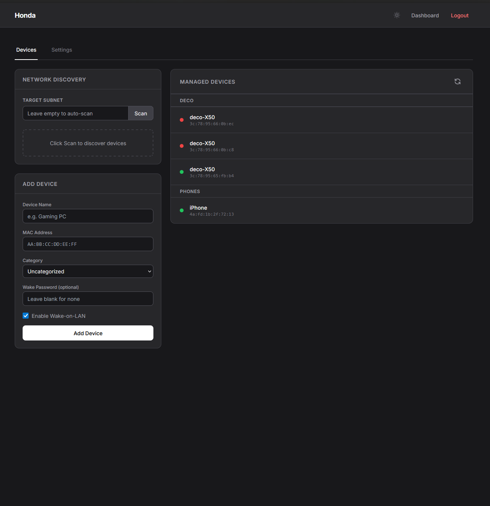
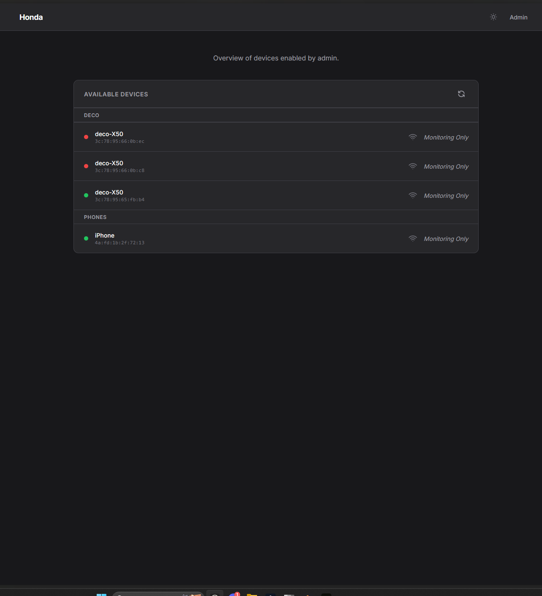

# Honda WOL

A modern Wake-on-LAN (WOL) web application with network discovery, device management, and a clean dark mode interface.





## Environment Variables

You can copy the `.env.example` file to `.env` and edit it to your liking.

## Deployment

### Using Docker Compose (Recommended)

1. Grab the `docker-compose.yml` file
2. Edit env vars to your liking
3. Run `docker-compose up -d`

The application will be available at `http://localhost:8000`

Note, the app has to run in host mode for network discovery + sending WOL magic packets to work.

### Manual Deployment

```bash
# Install dependencies
pip install -r requirements.txt

# Run the application
uvicorn main:app --host 0.0.0.0 --port 8000
```